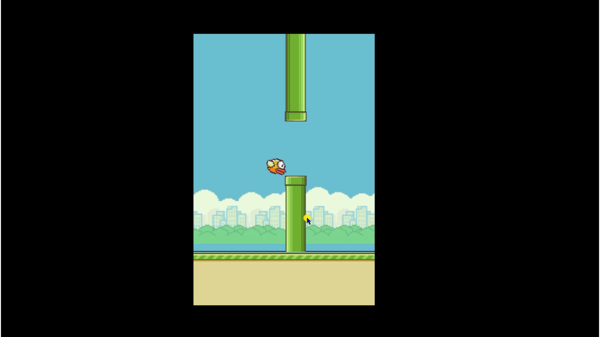

# Flappy-Bird-Game

Tutorial link of flappy bird [click here](https://youtu.be/8jx1_CbBSSk)

Here we are going to make the flappy bird game using HTML, CSS & JavaScript.

In this tutorial we will make the logic of game with the help of JavaScript and styling with the css.

## Topics covered 

* addEventListener
* DOMContentLoaded
* function
* if else statement
* setInterval
* clearInterval
* setTimeout
* clearTimeout
* classList

